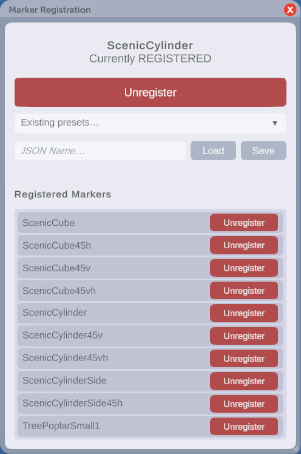

# Natural Peep Movement

A Parkitect mod that lets peeps and workers walk diagonally between path tiles instead of being restricted to the four cardinal directions. Paths keep their normal appearance; only movement is expanded to 8-way. Peeps will also avoid decoration objects that are regisrered and also intersect with a Path Tiles 1x1 area. 

## What it does
- **Diagonal walking on regular paths.** Guests, janitors, mechanics, entertainers, and security can cut corners and move in all 8 directions where path tiles allow.
- **Corner-cut protection.** Diagonals are only permitted when both orthogonal corner tiles are also walkable path, so peeps never clip through buildings, walls, or scenery at the outside of a bend.
- **Queues and interaction points untouched.** Queue lines, ride entrances/exits, shop counters, benches, trash bins, ATMs, and the park entrance stay 4-direction by design, preserving the vanilla visual and animation behavior around interactions.
- **Save/load safe.** No custom data is written to saves; the mod just adjusts how existing connections are interpreted at runtime.
- **Multiplayer.** Required by all players (pathfinding must match across the session).

## Object Avoidance
- **Register decoractions as path blockers.** Register decorations so peeps treat any path tile they overlap with as unwalkable.
- **In-game registration window.** Press `Ctrl+Alt+\` (rebindable) while a decoration is selected for placement to open a window that registers or unregisters the active object. Works for items picked from the deco panel or grabbed with the eyedropper.
- **Whole-tile only.** A marker overlapping any portion of a 1×1 path tile blocks the entire tile. Partial tile routing (peeps walking around an object on the same tile) is not supported.
- **Real-time updates.** Registering or unregistering a object takes effect within about a second. Peeps re-route on the fly, including around ghost previews before placing the object.
- **Preset library for sharing.** Save your registry as a named JSON file in `Documents/Parkitect/Mods/NaturalPeepMovement/presets/` and load presets back from a dropdown in the registration window. Share the JSON alongside your `.park` file so others see the same avoidance behavior in your park.
- **Park-name auto-load.** If the loaded park's name matches a preset filename (e.g. `River Park.park` <<>> `River Park.json`), the preset loads automatically on park entry and a notification confirms how many markers were registered. (See screenshots below)
- **Multiplayer.** All players need the same registered list for pathfinding to stay consistent — share the preset JSON with co-builders the same way you share the park file.

  **Tool Window**  
  

  **UI Notificiations**
    
  

## Author
RavenStryker - [github.com/RavenStryker](https://github.com/RavenStryker)

## License
[MIT](LICENSE) with an additional attribution clause: any mod that bundles this code or uses substantial portions of it must credit "RavenStryker" as an original author and link back to [github.com/RavenStryker](https://github.com/RavenStryker) in its README, credits, or in-game about screen.
